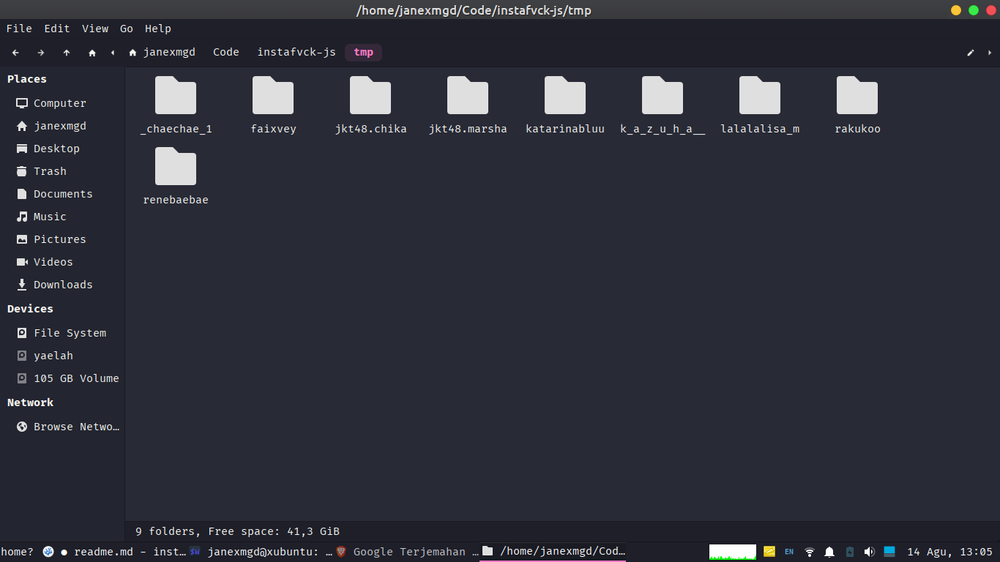

<a name="readme-top"></a>
<!-- PROJECT LOGO -->
<br />
<div align="center">
  <h1 align="center"><font size="9">Instafvck-js</font></h1>

  <p align="center">
  An javascript project to download media for instagram
    <br />
    <a href="https://github.com/janexmgd/instafvck-js"><strong>Explore the docs »</strong></a>
  </p>
</div>
<!-- TABLE OF CONTENTS -->
<details>
  <summary>Table of Contents</summary>
  <ol>
  <li><a href="#caution">Caution</a></li>
    <li>
      <a href="#about-the-project">About The Project</a>
      <ul>
        <li><a href="#built-with">Built With</a></li>
      </ul>
    </li>
    <li><a href="#set-cookie">Set Cookie</a></li>
    <li>
      <a href="#getting-started">Getting Started</a>
    </li>
    <li>
      <a href="#testing-environment">Testing Environment</a>
    </li>
    <li>
      <a href="#notes">Notes</a>
    </li>
  </ol>
</details>


### Caution

<b>*Avoid Account Suspension*</b>

**Please be aware of the following risk before proceeding!**

This Bulk Downloader tool is designed to facilitate bulk downloads from various sources. However, there's an inherent risk associated with any tool that interacts with external websites, as it might trigger automated security mechanisms, including account suspension or IP blocking.
<br>
**I am not responsible if your Instagram account gets suspended**
<br>
**<i>Do you with own risk</i>**


<!-- ABOUT THE PROJECT -->
## About The Project


This project is about developing tools for bulk downloading using Node.js. This tool is designed to provide an efficient solution for downloading a large number of files at once.

<p align="right">(<a href="#readme-top">back to top</a>)</p>


### Built With
 

<p align="right">(<a href="#readme-top">back to top</a>)</p>


<!-- SET COOKIE -->
### Set Cookie

1. Install at yout broswer https://chrome.google.com/webstore/detail/copy-cookies/jcbpglbplpblnagieibnemmkiamekcdg?hl=id
2. Open https://instagram.com and copy the cookies using this extension <strong>(I recommend not using your main Instagram account)</strong>
3. Make file with name cookies.js at src/utils with template at cookies.example <strong>dont forget to uncomment the code</strong> 
4. Edit variable cookies with your cookies obtained from step 2
<p align="right">(<a href="#readme-top">back to top</a>)</p>


<!-- GETTING STARTED -->
### Getting Started

1. Make sure you have the latest Node.js installed. (I'm using node js 19.9.0)
2. Clone this repository to your machine.
3. Install the dependencies
* npm
  ```sh
  npm install
  ```
<p align="right">(<a href="#readme-top">back to top</a>)</p>


<!-- HOW TO RUN -->
###  HOW TO RUN

1. Run this project at locally
  ```sh
  npm start
  ```
  or
  ```sh
  node index
  ```
  and follow the instruction
<p align="right">(<a href="#readme-top">back to top</a>)</p>


### Testing Environment

We have rigorously tested the Bulk Downloader in the following environment to ensure its functionality and reliability:

- **Operating System:** Xubuntu 22.04.2 LTS x86_64
- **Node.js Version:** 19.9.0


During our testing, we downloaded a diverse range of files from different sources to simulate real-world scenarios. The tool performed efficiently and as expected, meeting our requirements for bulk downloads.

Please note that while we have conducted extensive testing, variations in environments and network conditions may affect performance and results. We recommend testing the tool in your own environment before conducting large-scale downloads.


By using the Bulk Downloader in your environment, you acknowledge that the tool's performance may vary based on factors such as operating system, network speed, and server responsiveness.
<p align="right">(<a href="#readme-top">back to top</a>)</p>


<!-- NOTES -->
### Notes
The file will saved at
<br>
pathtothis/tmp

<p align="right">(<a href="#readme-top">back to top</a>)</p>


